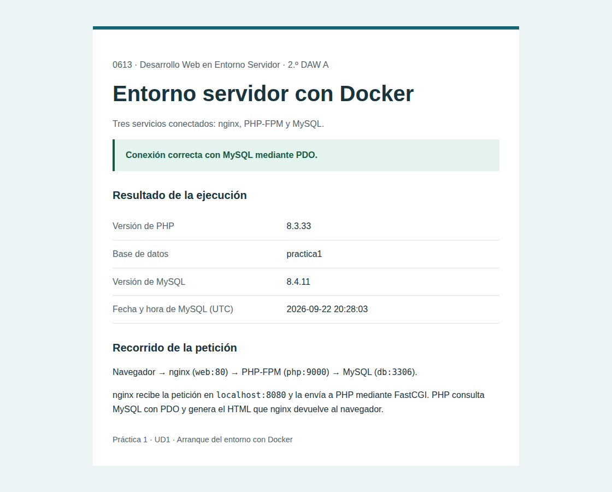

# Práctica 1 · Entorno servidor con Docker

0613 · Desarrollo Web en Entorno Servidor · 2.º DAW A

Alejandro de la Osa

Entorno de desarrollo con tres servicios separados: nginx recibe HTTP en el puerto 8080, PHP 8.3 ejecuta el código mediante PHP-FPM y MySQL almacena los datos. La aplicación comprueba la conexión mediante PDO.

## Puesta en marcha

Requiere Docker Engine con Docker Compose v2 o Docker Desktop en modo de contenedores Linux.

Clona el repositorio y entra en su carpeta:

```sh
git clone https://github.com/DLAOSA/daw-practica1-docker.git
cd daw-practica1-docker
```

Desde la raíz del repositorio:

```sh
docker compose up -d
```

La primera ejecución descarga las imágenes y construye PHP. Después, abre <http://localhost:8080>.

## Resultado



Captura obtenida en Chromium durante la [ejecución de pruebas superada](https://github.com/DLAOSA/daw-practica1-docker/actions/runs/35780305976), con los tres contenedores activos en GitHub Actions. También se comprobaron la [vista móvil](docs/resultado-movil.png), el [error de conexión](docs/error-conexion.png) y la recuperación de MySQL.

## Arquitectura

```text
Navegador → localhost:8080 → web:80 → php:9000 → db:3306
                              HTTP    FastCGI     PDO/MySQL
```

nginx recibe la petición y comunica a PHP-FPM la ruta de `index.php` mediante `SCRIPT_FILENAME`. Los dos servicios montan `src` en `/var/www/html`. PHP ejecuta el script, consulta MySQL con PDO y devuelve el HTML a nginx. Compose crea una red interna y resuelve los nombres `php` y `db`; dentro de PHP, `localhost` sería el propio contenedor, no MySQL.

PHP espera a que MySQL acepte una consulta autenticada; nginx espera a que PHP-FPM escuche en el puerto 9000. Así se evita el fallo de conexión durante la inicialización. Los datos de MySQL persisten en el volumen `db_data`.

Frente a XAMPP, separar los servicios permite cambiar sus versiones y recrearlos de forma independiente, reproducir el entorno mediante archivos y evitar instalar PHP/MySQL directamente en el equipo. Como límites, Docker requiere aprender redes y volúmenes, descargar imágenes y dedicar recursos al motor; en Windows usa una máquina virtual Linux. XAMPP resulta más directo para una primera prueba local. Docker ayuda a reproducir el entorno, pero no convierte esta configuración de desarrollo en un despliegue de producción.

## Comprobaciones y parada

```sh
docker compose ps
docker compose logs web php db
docker compose exec php php -l /var/www/html/index.php
docker compose exec web nginx -t
docker compose down
```

Para probar el `catch`, ejecuta `docker compose stop db` y recarga la página: debe mostrar un error controlado y devolver HTTP 503. Ejecuta `docker compose up -d` para recuperar la conexión. `docker compose down` conserva los datos; añadir `-v` elimina el volumen y sus datos.

Solo se publica el puerto 8080 y queda limitado a este equipo. Las contraseñas del Compose son ejemplos para esta práctica local; PHP usa `alumno`, no `root`. No uses estas credenciales en otros entornos.

## Validación automática

El flujo de GitHub Actions arranca el entorno en Linux, verifica las configuraciones, comprueba la consulta PDO desde Chromium y captura la página en escritorio y móvil. Después detiene MySQL, comprueba la respuesta de error y verifica la recuperación. Las capturas y registros se guardan como artefacto `evidencias-docker`. Node y Playwright se usan únicamente para estas pruebas; la aplicación solo requiere Docker.

## Historial

El historial recoge la preparación del repositorio, la configuración de los servicios, la página PHP y la validación del conjunto.

La memoria técnica está disponible en [Word, con la plantilla facilitada](docs/memoria.docx), y en [Markdown](docs/memoria.md).

## Referencias

- [Orden de arranque en Docker Compose](https://docs.docker.com/compose/how-tos/startup-order/).
- [Imagen oficial de PHP y extensiones](https://hub.docker.com/_/php).
- [FastCGI en nginx](https://nginx.org/en/docs/http/ngx_http_fastcgi_module.html).
- [Imagen oficial de MySQL](https://hub.docker.com/_/mysql).
